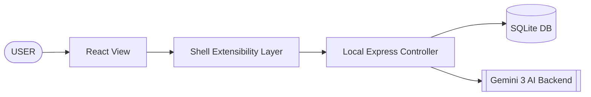

# Gem Suite 💎

**The Intelligence Laboratory of Connected AI Assistants.**

Gem Suite is a premium, production-ready desktop ecosystem designed to bring the sophisticated reasoning of the **Gemini 3** ecosystem into your daily workflow. It is not just a single application, but a high-performance **Extensible AI Framework** hosting a collection of deep-purpose "Gem" applications.

---

## 🌟 The Gem Collection (Non-Technical)

### ✉️ Gem Amnatrada: The Master Invitationist
A smart assistant that transforms your event details into elegant, ready-to-send invitations.
*   **Natural Creation**: Just tell it who, when, and where. It handles the formatting.
*   **Themes**: Choose from premium aesthetic styles (Modern, Traditional, Minimal).
*   **Instant Result**: Download a high-quality preview or share the invitation details immediately.
*   **Why it's special**: It doesn't just fill a template; it understands the "vibe" of your event.

### 🗺️ Gem Musafir: The Dream Trip Planner
Your personal travel concierge that dreams up perfect itineraries so you don't have to research for hours.
*   **Day-by-Day Journey**: Get a structured plan including cities, state-level transitions, and hidden gems.
*   **Smart Budgeting**: Estimates travel, stay, and food costs across your entire route.
*   **Route Optimization**: It knows the best way to move from city to city, ensuring you spend more time exploring and less time traveling.
*   **Digital Dossier**: Generates a professional PDF itinerary for your offline use.

### ✍️ Gem Likhit: The Intelligent AI Editor
A next-generation writing environment that feels like a clean page but works like a genius collaborator.
*   **Ghost Typing**: The AI predicts your next sentence in real-time, helping you flow through your writing.
*   **Premium Selection Menu**: A high-performance, glassmorphism-inspired action menu that lets you Rewrite, Translate, or Summarize selection with a single tap.
*   **Drafting Commands**: Use "//@" commands to tell the AI to write entire paragraphs or drafts on your behalf.
*   **Designer Typography**: Optimized for reading with Lora (Serif) and Inter (Sans), providing a distraction-free, editor-grade experience.

### 📝 Gem Vivarad: The ATS-Optimized Resume Maker
A powerful assistant that transforms your raw experience into an ATS-friendly, professionally formatted resume.
*   **Smart Transformation**: Converts your structured resume data into an ATS-optimized, keyword-rich JSON.
*   **Dynamic Preview**: Instantly preview your transformed resume in a clean UI.
*   **Flexible Exports**: Download your resume in various PDF formats: Standard, LaTeX-based, and Premium templates.
*   **Privacy-First**: Ensures strict PII separation during AI processing, keeping your personal data secure.

---

## 🛠️ Technical Prowess & Production Standards

### Leveraging Gemini 3
The suite is architected to exploit the multi-modal and long-context capabilities of **Gemini 3**.
*   **Structured Reasoning**: Every interaction uses high-reasoning prompts that return deterministic, schema-validated JSON for complex tasks like resume generation, ensuring ATS compliance and template readiness.
*   **Low Latency**: Optimized stream-handling and intelligent data transformation (including an adapter pattern for UI compatibility) ensure the AI feels "alive" and responsive, especially for complex workflows like resume creation.

### A Production-Grade Ecosystem
*   **Local-First Architecture**: Features a local Express server and a high-performance **SQLite (WASM)** database (`packages/db`). Your data is handled with production-level persistence.
*   **Desktop Container**: Wrapped in **Electron**, providing a native Windows experience with global shortcuts, native notifications, and a dedicated process per app.
*   **Industrial Monorepo**: Built using a modern TypeScript monorepo structure (Vite + Node16 + ESM), ensuring high modularity and extreme scalability.
*   **Resilience**: Integrated health checks, error boundaries, and a "Loader-to-App" boot sequence ensure the app never hangs.

---

## 🏗️ Architecture

### High-Level Architecture
The system follows a "Distributed Desktop" pattern where the UI, Logic, and AI layers are strictly decoupled:


### Low-Level Architecture (The Framework)
The Gem Suite is an **Extensible Framework**. Adding a new AI application is as simple as registering a component in the `appGroup` registry.
1.  **Apps (The View Layer)**:
    *   `apps/web`: The React-based design system using a shared `theme.ts` for consistent glassmorphism and premium aesthetics.
    *   `apps/server`: The "Brain". Handles validation, local DB access, and secure communication with AI services.
    *   `apps/desktop`: The "Host". Orchestrates the server lifecycle and provides the native window environment.
2.  **Shared Packages (The Logic Layer)**:
    *   `packages/shared`: Contract-level definitions (Interfaces, Types, Constants) used by both Server and Web.
    *   `packages/db`: The model layer. Pure TypeScript interface to the local SQLite storage.

---

## 🚀 Future-Proof Extensibility
This suite is designed for growth. The **Shell Architecture** allows developers to plug in new "Gem" apps with their own icons, routing, and logic without touching the core system. Whether it's a Financial Analyst Gem or a Coding Assistant Gem, the framework provides the plumbing (AI auth, DB access, Windowing) out of the box.

---

## ⚙️ Development

```powershell
npm install      # Install dependencies
npm run build    # Build packages
npm run dev      # Start everything (Web, Server, Desktop)
```

**Gem Suite © 2026**