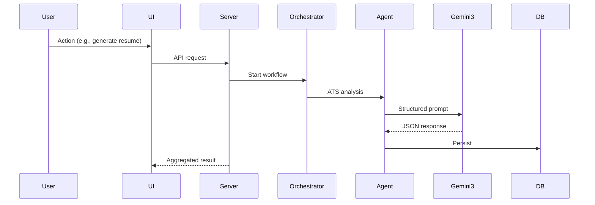

---
# Project Title

Gem Suite — an extensible, local-first desktop AI workbench for productivity apps (Resume, Invitations, Trip Planner, Text Editor).

## Elevator Pitch
Gem Suite addresses fragmented, network-dependent AI productivity tools by providing a secure, extensible, local-first desktop platform that runs modular 'Gems' (apps) with integrated AI agents. The product bundles a React/Electron frontend, a forked Express backend, SQLite WASM local persistence, and tightly orchestrated Gemini 3 agents to deliver low-latency, privacy-preserving AI experiences. It matters because teams and individuals need powerful AI assistance without sending sensitive data to many third-party services. Unique aspects include a plugin-style Gem registry, Model Context Protocol (MCP) orchestration for tools, and offline-first persistence. We use Gemini 3 (gemini-3-flash-preview) for core natural-language generation, structured reasoning, and multi-agent coordination.

---

## Problem & Solution Writeup
### Problem
- Real-world problem: users rely on multiple cloud AI services and fragile web apps for document creation, planning, and design; this fragments workflows and exposes PII.
- Who is affected: knowledge workers, recruiters, small-business event planners, and users needing compliant AI assistance.
- Why current solutions fail: cloud-only services introduce latency, data leakage risk, inconsistent integrations, and limited offline capability; existing desktop apps lack modern AI orchestration.
- Scale of impact: millions of desktop and hybrid workers who prefer local or private computation, and enterprises with compliance requirements.

### Solution
- How the system works: an Electron container runs a forked local Express server, React SPA front-end, and SQLite WASM database. AI features are implemented as modular agents registered with an Agent Orchestrator and exposed via MCP tools for structured, validated outputs.
- Key features:
  - Modular Gems (Resume, Invitation, Trip Planner, Text Editor)
  - Local-first persistence using SQLite WASM
  - Agent orchestration (workflow templates + parallel agents)
  - Gemini 3 integration for structured responses and multi-step reasoning
  - Secure IPC and encrypted local storage
- Why it solves the problem better: low-latency local server, privacy-preserving data flow, deterministic agent workflows, and extensibility via plugin-style registration.

---

## Technical Writeup
### Architecture Overview
- Frontend: React + Vite SPA inside Electron renderer; componentized Gem apps and shell UI.
- Backend: Node/Express forked as an isolated child process; orchestrates MCP server, agent workflows, and proxies to Gemini 3.
- AI/ML components: Gemini 3 (gemini-3-flash-preview) for LLM tasks; multiple specialized agents (resume, formatting, route planning, image/design) run as orchestrated workflows.
- APIs and services used:
  - Gemini 3 Generative API (text + image)
  - Local MCP for tool/resource management
  - Optional external APIs (geocoding, maps) via proxied adapters
- Data flow:
  1. User action in UI → request to local Express server
  2. Orchestrator dispatches agents (local tools, Gemini 3 calls)
  3. Agents return structured JSON → validation → persistence in SQLite WASM
  4. UI renders results; optional export (PDF, LaTeX)

### Technical Execution
- Tech stack: TypeScript, React 18, Vite, Electron, Node.js (Express), ESBuild, SQLite (sql.js WASM), Gemini 3.
- Code structure: monorepo with `apps/` (desktop, server, web), `packages/` (db, shared), clear `agents/`, `mcp/`, `orchestration/`, and `services/` layers (see project `str.md`).
- Deployment: packaged with Electron Builder for Windows (ASAR + bundled server + sql-wasm.wasm); development uses `npm run dev` to orchestrate server + web + desktop.
- Scalability & performance:
  - Local-first design minimizes network bottlenecks; parallel agent execution and response caching reduce latency for repeated queries.
  - Token/cost management via `tokenCounter` and prompt optimization.
- Reliability & security:
  - Process isolation (main/renderer/server) and secure `preload` bridge.
  - Encrypted local DB, key storage (keytar), PII anonymization before sending to Gemini 3.

---

## Innovation Writeup
- Novelty:
  - Local-first desktop AI with production-grade packaging and a plugin-style Gem registry.
  - MCP-based tool orchestration bridges LLM outputs and deterministic system actions.
- Differentiation from existing solutions:
  - Unlike cloud-only apps, Gem Suite preserves privacy and offline capability while still leveraging high-quality LLMs.
  - Clear developer surface for new Gems and agent composition.
- Unique AI usage:
  - Structured reasoning prompts produce JSON-validated outputs consumed directly by services (reduces post-processing costs).
  - Multi-agent pipelines (e.g., ATS scoring → content generation → template formatting → QA) give modular, auditable workflows.
- UX/automation breakthroughs:
  - Ghost-overlay inline AI suggestions in the editor, stepper-based wizard flows for invitations, and one-click export with template application.

---

## Gemini 3 Usage
- How Gemini 3 is used:
  - Primary LLM model: `gemini-3-flash-preview` for generation, structured outputs, and image hints.
  - Calls are proxied through `apps/server/proxies/gemini3.ts` with enforced schema validation.
- Prompts & workflows:
  - Use structured system prompts that request JSON outputs with explicit schemas (e.g., resume JSON with fields for sections, bullets, ATS tags).
  - Multi-step orchestration: agents call Gemini 3 with constrained sub-prompts (analysis, generation, QA) and merge results via the orchestrator.
- Why Gemini 3 is essential:
  - High-quality structured reasoning with long-context handling enables multi-step agent pipelines that simpler models cannot reliably perform.
  - Gemini 3's combined text+image primitives enable integrated design generation for invitations and assets.
- Performance benefits:
  - Reduced token usage via targeted prompts, leading to lower cost and latency; Flash Preview model provides fast responses appropriate for desktop interactivity.
- Multi-agent/advanced orchestration:
  - MCP coordinates tools (e.g., ATS tool, geocode tool) and Gemini 3, enabling deterministic tool calls, caching, and parallel execution.

---

## Potential Impact
- Market size & user base: productivity apps for SMBs, recruiters, event planners; TAM in tens of millions of users globally for desktop productivity.
- Adoption scenarios:
  - Recruiters using ATS-optimized resume generation
  - Event planners generating localized invitations and itineraries offline
  - Writers and knowledge workers using inline AI for drafts and edits
- Social/economic impact:
  - Reduces time-to-completion for common content tasks; reduces data exposure by keeping data local.
- Future expansion:
  - Cloud-sync option, team collaboration features, third-party plugin marketplace, enterprise compliance modes.

---

## Presentation / Demo
- Demo walkthrough:
 1. Launch desktop app (installer or `npm run dev`).
 2. Open Resume Gem → paste CV data → run ATS analysis → regenerate resume with template → export PDF.
 3. Open Trip Planner Gem → provide cities → generate itinerary → export PDF.
 4. Show offline mode: disconnect network and run local-resident features.
- Screenshots / video placeholders:
  - [Screenshot: Home Shell – Gem tiles](/assets/demo-home.png)
  - [Screenshot: Resume pipeline results](/assets/demo-resume.png)
  - [Video: 2-minute walkthrough link placeholder]
- How judges can test/run:
  - Steps: install from provided installer OR run `npm install && npm run dev`.
  - Local server runs on `http://localhost:3001` (or Electron loads UI automatically).
- Documentation highlights:
  - `tech.md` for architecture, `str.md` for structure, and README for build/distribution steps.

---

## Diagrams
### Architecture Diagram
```mermaid
flowchart LR
  A[Electron Renderer (React)] --> B[Local Express Server]
  B --> C[Agent Orchestrator / MCP]
  C --> D[Gemini 3 (proxy)]
  B --> E[SQLite WASM]
  A -->|IPC| B
```
Explanation: Electron renders the UI and communicates via a secure preload IPC with the local Express server; the server manages MCP and agent orchestration and persists in SQLite WASM.

### Data Flow Diagram

Explanation: This sequence shows request→agent→LLM→persistence→UI cycles used across Gems.

---

## Judging Alignment Summary
### Technical Execution (40%)
- Demonstrates high-quality engineering:
  - Production-ready packaging (Electron Builder), strict TypeScript typing, structured tests, and CI-friendly build scripts.
  - Implemented agent orchestration, MCP, and robust Gemini 3 proxy with retries and schema validation.
  - Local-first persistence with SQLite WASM ensures reproducible runs for judges.

### Potential Impact (20%)
- Why it matters at scale:
  - Addresses privacy and offline capability demanded by enterprises and privacy-conscious users.
  - Multiple verticals (recruiting, events, travel) with immediate productivity gains.

### Innovation / Wow Factor (30%)
- Novel & impressive aspects:
  - MCP-driven multi-agent pipelines that translate LLM outputs directly into deterministic tools and actions.
  - Integrated Gemini 3 structured outputs and image generation for end-to-end UX (content → design → export).

### Presentation / Demo (10%)
- Clarity and strength:
  - Step-by-step demo, reproducible local install, architecture and structure docs (`tech.md`, `str.md`) and visual diagrams for judges to verify claims.

---

Tone: professional, concise, technical. Edits welcome to tailor details for judging preferences.
